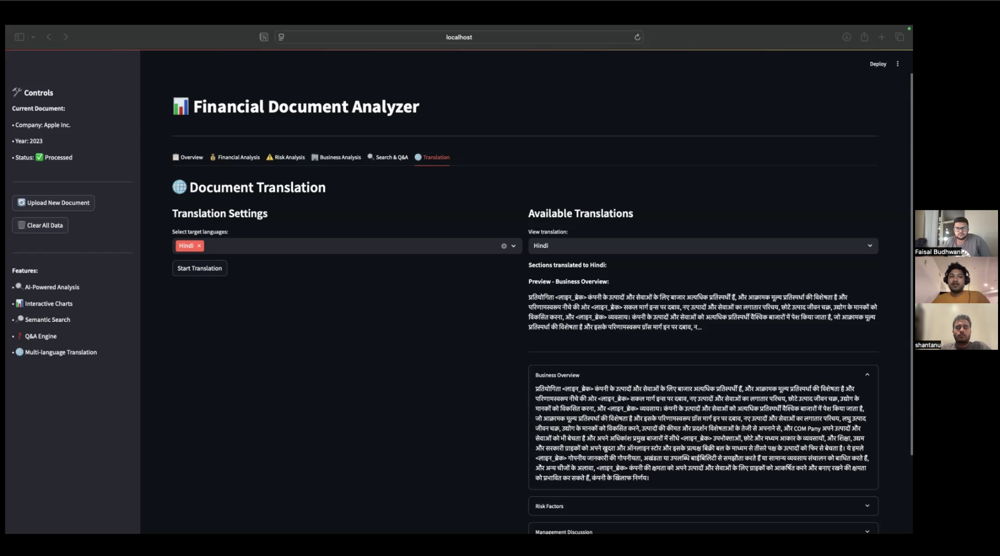
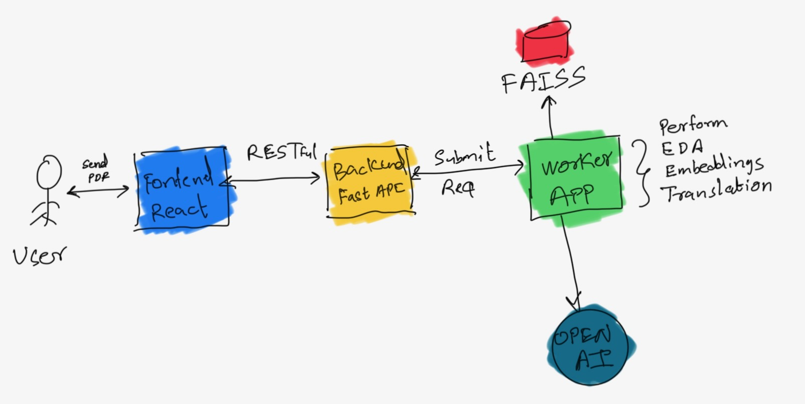

## Video Demo


<a href="https://drive.google.com/file/d/1XyfnSde8UNrIAqKMFGHFyJvyuNGO3WOA/view" target="_blank">
    
</a>

> **Note:** Click on the picture above to play the video. If you want to download the video, it is located in the `Video_Demo` folder.

---

# Financial Document Analyser

AI-powered tool for automated mining and analysis of large PDF financial documents, featuring semantic search, question-answering, and multi-language translation.

---

## Team - 01

- **Faisal Budhwani**
- **Shantanu Joshi**
- **Siddharth Kulkarni**

---


## Overview

Financial documents like analyst reports, annual filings, and statements are often complex and unstructured, making it difficult and time-consuming to extract actionable insights. Our analyser leverages AI and automation to transform these documents into structured, searchable data—empowering users to quickly find answers, analyze trends, and make better decisions.

For more details, see the [report.pdf](docs/report.pdf) in the `docs` folder.

---

## Features

- **Automated PDF Extraction:** Extracts text, tables, images, and complex layouts using AI and OCR.
- **Semantic Search & QA:** Ask questions in natural language and get accurate answers with source references, powered by vector search and finance-specific language models.
- **AI Analysis:** Identifies key financial metrics, summarizes sections, and highlights risk factors for deeper insights.
- **Interactive Visualizations:** Generates charts and dashboards for trends, comparisons, and summaries.
- **Multi-Language Support:** Translates documents while preserving formatting and financial terminology, supporting global teams and compliance needs.
- **Integration Ready:** Extracted data can be exported or integrated with databases and analytics tools.

---

## Architecture




---

## Quick Start

1. **Clone & Install**
    ```
    git clone https://github.com/siddharthck/255-pdf-data-mining.git
    cd 255-pdf-data-mining
    python -m venv venv
    source venv/bin/activate  # On Windows: venv\Scripts\activate
    pip install -r requirements.txt
    ```
2. **Set API Key**
    - Add your OpenAI key to a `.env` file:  
      `OPENAI_API_KEY=your_openai_api_key_here`
3. **Run Streamlit**
    ```
    streamlit run main.py
    ```
    Access at [http://localhost:8501](http://localhost:8501)

    ALternatively you can also run  FAST API + REACT (not stable)
 Run FastAPI
    ```
    python -m uvicorn main.fastapi_app:app --reload
    ```
    Access at [http://localhost:8000](http://localhost:8000)
   Start Frontend
    ```
    cd frontend-v1
    npm install
    npm start
    ```
    Access at [http://localhost:3000](http://localhost:3000)

and start frontend

> **Note:** The Streamlit UI is more stable and is recommended for use.

---

## Example Queries

- "Summarize the company’s main revenue sources."
- "What are the key risk factors?"
- "Show revenue trends over the last 3 years."

---

## Why Use This Tool?

- **Faster, More Accurate Analysis:** Automates extraction and reduces human error, delivering insights in seconds.
- **Handles Complex Documents:** Interprets tables, charts, and unstructured text—no manual copy-paste needed.
- **Supports Multilingual Teams:** Translate and analyze documents for global collaboration and compliance.
- **Integration & Scalability:** Ready for integration with your analytics or reporting stack.

---

## Contributing

Pull requests welcome! For major changes, please open an issue first.


---

## Acknowledgments

- OpenAI, FAISS, Hugging Face, Streamlit

---

## Task Distribution Among Group Members

**Faisal Budhwani (017627363):**
- PDF processing pipeline implementation (pdfplumber, Camelot, PyMuPDF integration)
- Text extraction and preprocessing algorithms
- Document structure recognition and section identification
- OCR integration and image processing workflows

**Shantanu Joshi (018173987):**
- Semantic search engine development using FAISS
- Sentence transformer integration and vector embedding generation
- Question-answering system implementation with GPT-4
- Search optimization and context management algorithms

**Siddharth Kulkarni (018219435):**
- EDA pipeline development and automated visualization generation
- Translation system implementation with dual-approach strategy
- Streamlit frontend development and user interface design
- System integration and comprehensive testing
